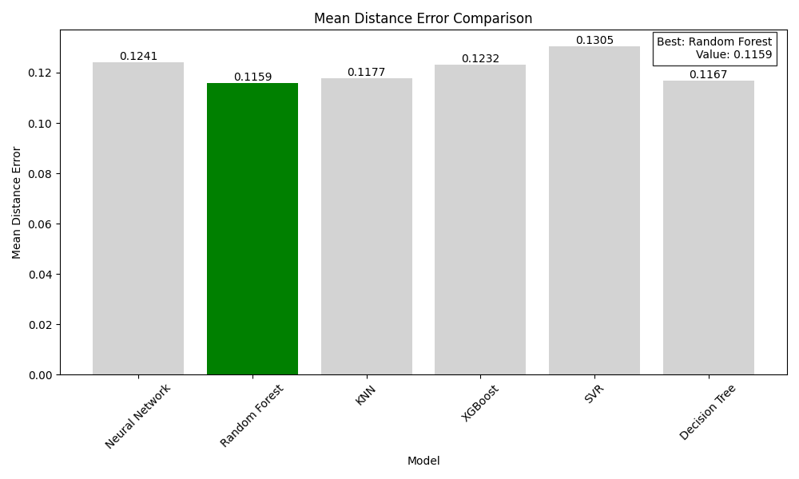
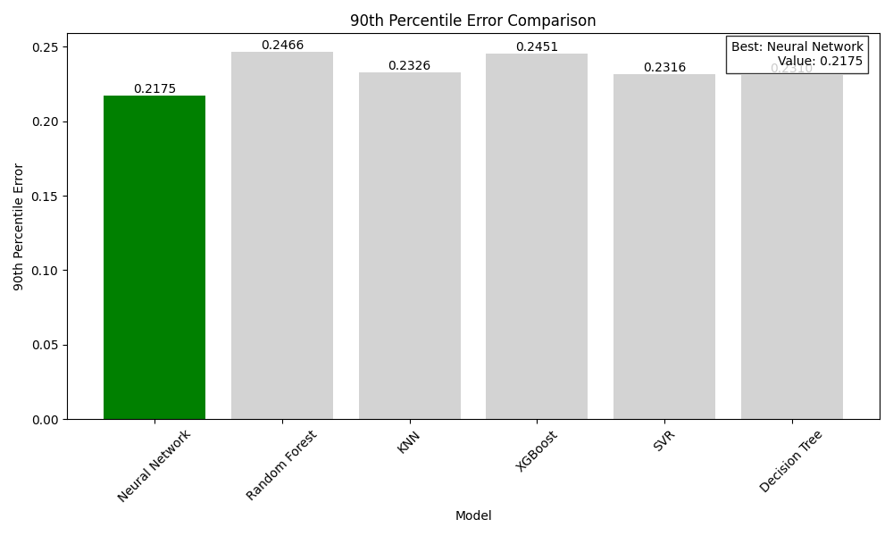

# iBeacon RSSI Verileri Kullanılarak İç Mekan Konum Tahmini: Makine Öğrenmesi Modellerinin Karşılaştırmalı Analizi

## Yönetici Özeti
Bu rapor, iBeacon RSSI (Alınan Sinyal Gücü Göstergesi) verilerini kullanarak iç mekan konum tahmini için çeşitli makine öğrenmesi modellerinin kapsamlı bir karşılaştırmasını sunmaktadır. Altı farklı modeli değerlendiriyoruz: Sinir Ağı, Rastgele Orman, K-En Yakın Komşular (KNN), XGBoost, Destek Vektör Regresyonu (SVR) ve Karar Ağacı.

## 1. Giriş
iBeacon teknolojisi kullanılarak iç mekan konum tahmini, çeşitli uygulamalar için giderek daha önemli hale gelmiştir. Bu çalışma, geleneksel modelleri derin öğrenme çözümüyle karşılaştırarak en etkili makine öğrenmesi yaklaşımını belirlemeyi amaçlamaktadır.

## 2. Metodoloji

### 2.1 Veri Seti
- **Etiketli Veri**: 1,420 örnek
- **Etiketsiz Veri**: 5,191 örnek
- **Özellikler**: 13 iBeacon RSSI okuması
- **Hedef**: 2B koordinatlar (x, y) [0,1] aralığında normalize edilmiş

### 2.2 Veri Ön İşleme
1. Eksik değer doldurma (-200 RSSI değerleri -150 ile değiştirildi)
2. MinMaxScaler kullanılarak özellik normalizasyonu
3. Kategorik koordinatlar için LabelEncoder kullanılarak konum kodlaması
4. Eğitim-test ayrımı (80-20) tutarlı rastgele tohum ile

### 2.3 Uygulanan Modeller
1. **Sinir Ağı**: Otokodlayıcı ön eğitimi ile Conv1D tabanlı mimari
2. **Rastgele Orman**: 100 tahminleyici
3. **KNN**: k=5 komşu
4. **XGBoost**: Kare hata hedefli gradyan artırma
5. **SVR**: RBF çekirdeği
6. **Karar Ağacı**: Maksimum derinlik 10

## 3. Sonuçlar ve Analiz

### 3.1 Performans Metrikleri

#### Temel Bulgular:
1. **Doğruluk Metrikleri** (Not: Tüm hata metriklerinde düşük değerler daha iyidir):
   - En Düşük Ortalama Mesafe Hatası: Rastgele Orman (0.1159) - en iyi performans
   - En Düşük Medyan Mesafe Hatası: KNN (0.0895) - en iyi performans
   - En Düşük 90. Yüzdelik Hata: Sinir Ağı (0.2175) - en iyi performans
   - En Düşük RMSE: Rastgele Orman (0.1437) - en iyi performans
   - En Düşük MSE: Rastgele Orman (0.0206) - en iyi performans

2. **Hata Dağılımı**:

- Sinir Ağı daha tutarlı hata dağılımı gösteriyor
- Geleneksel modeller benzer hata paternleri sergiliyor
- KNN tipik durumlarda güçlü performans gösteriyor

### 3.2 Hesaplama Verimliliği

.png)

#### Performans Analizi:
1. **Eğitim Verimliliği** (Not: Düşük süreler daha iyi performansı gösterir):
   - En Kısa Süre: KNN (0.0014s) - en verimli model
   - En Uzun Süre: Sinir Ağı (81.52s)
   - Geleneksel modeller önemli ölçüde daha hızlı eğitiliyor

2. **Çıkarım Hızı** (Not: Düşük süreler daha iyi performansı gösterir):
   - En Kısa Süre: Karar Ağacı (0.0002s) - en verimli model
   - En Uzun Süre: Sinir Ağı (0.2143s)
   - Tüm geleneksel modeller milisaniyenin altında çıkarım süreleri gösteriyor

### 3.3 Konum Tahmin Karşılaştırması

Bu görselleştirmeler, her bir modelin tahmin ettiği konumlar ile gerçek konumları karşılaştırmaktadır:
- Mavi noktalar gerçek konumları göstermektedir
- Kırmızı noktalar tahmin edilen konumları göstermektedir
- Noktaların yakınlığı tahmin doğruluğunu gösterir

Önemli gözlemler:
- Rastgele Orman en tutarlı tahmin dağılımını göstermektedir
- Sinir Ağı bazı bölgelerde daha hassas tahminler yapmaktadır
- KNN ve XGBoost benzer tahmin paternleri sergilemektedir
- Karar Ağacı ve SVR daha geniş bir tahmin dağılımına sahiptir

## 4. Tartışma

### 4.1 Model Değiş Tokuşları
1. **Sinir Ağı**:
   - Artılar: 90. yüzdelik hatada en iyi performans (0.2175)
   - Eksiler: En uzun eğitim (81.52s) ve çıkarım (0.2143s) süreleri
   - Not: Diğer hata metriklerinde ortalama performans

2. **Geleneksel Modeller**:
   - Artılar: Hızlı eğitim ve çıkarım, düşük hata oranları
   - Eksiler: Bazı uç durumlarda daha yüksek hata
   - Not: Rastgele Orman RMSE (0.1437) ve MSE (0.0206) ile en iyi performansı gösteriyor

### 4.2 Öneriler
1. **Gerçek Zamanlı Uygulamalar**:
   - Öneri: Karar Ağacı veya KNN
   - Gerekçe: Hızlı çıkarım süresi, rekabetçi doğruluk

2. **Doğruluk Kritik Uygulamalar**:
   - Öneri: Rastgele Orman
   - Gerekçe: En iyi RMSE/MSE skorları, iyi genel performans ve uç durumları ele alma

3. **Kaynak Kısıtlı Ortamlar**:
   - Öneri: Karar Ağacı
   - Gerekçe: Minimum hesaplama gereksinimleri, iyi genel performans

## 5. Sonuç
Çalışma, sinir ağı yaklaşımı uç durumları daha iyi ele alırken, geleneksel makine öğrenmesi modellerinin önemli ölçüde daha iyi hesaplama verimliliği ile rekabetçi doğruluk sağladığını göstermektedir. Model seçimi, doğruluk, hesaplama kaynakları ve çıkarım hızı arasındaki değiş tokuşlar göz önünde bulundurularak spesifik uygulama gereksinimlerine göre yapılmalıdır.

## Ek
Tam performans metrikleri ekteki [model_comparison_results.csv](model_comparison_results.csv) dosyasında mevcuttur.

